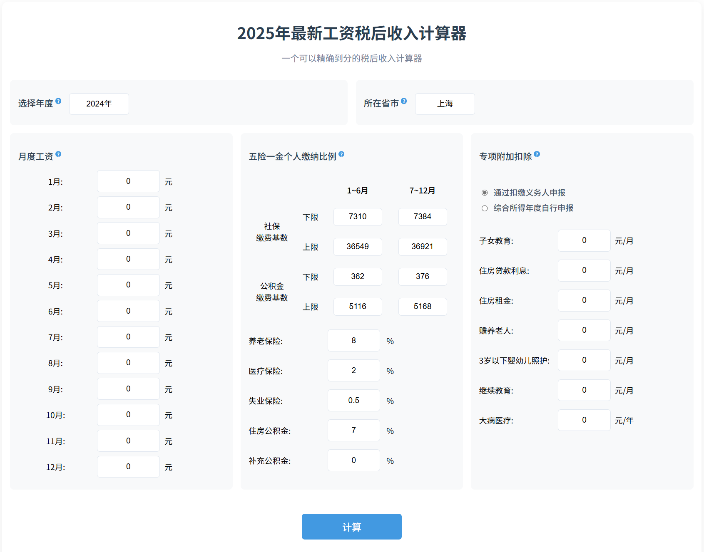

# 2025年最新个人所得税计算器 (Income Calculator)

## 💰 精确到分的税后收入计算工具


**专为2025年最新个税和社保政策优化**，提供精确到分的薪资计算服务，帮助您清晰了解：
- 每月实际到手收入
- 五险一金详细扣除
- 个税专项附加扣除

## 🖥️ 界面预览


## ✨ 核心计算功能

### 📊 综合收入计算
- 自动适配2025年最新个税税率表
- 精确计算五险一金

### 🏠 专项附加扣除
- 子女教育：每个子女每月2000元
- 继续教育：每月400元（学历）或3600元（职业资格）
- 大病医疗：8万元限额内据实扣除
- 住房贷款利息：每月1000元
- 住房租金：按城市级别800-1500元/月
- 赡养老人：每月3000元（独生子女）或1500元（非独生子女）


## 📈 计算逻辑与公式

### 个税计算公式
```
应纳税所得额 = 累计收入 - 累计减除费用(5000元/月) - 累计专项扣除(三险一金) - 累计专项附加扣除 - 其他扣除
应纳税额 = 应纳税所得额 × 税率 - 速算扣除数
实发工资 = 应发工资 - 三险一金 - 应纳税额
```

## 🏆 为什么选择我们的计算器？

1. **政策最新**：实时跟踪2025年最新税收和社保政策
2. **计算精确**：采用官方算法，结果与税务局系统一致
4. **透明可视**：详细展示每一分钱的去向
5. **隐私安全**：所有计算在本地完成，数据不上传

## 🛠️ 技术实现

### 数据来源
- 个税税率表：国家税务总局2025年公告
- 社保比例：各城市人社局最新文件
- 公积金比例：各城市公积金管理中心规定

### 技术栈
- **前端框架**: Nuxt 4
- **UI框架**: Vue 3
- **核心计算**: TypeScript严格类型校验
- **数据**: JSON动态配置，便于政策更新

## 🚀 快速开始

### 安装依赖

```bash
pnpm install
```

### 开发模式

```bash
pnpm dev
```

### 生产构建

```bash
pnpm build
```

### 预览生产版本

```bash
pnpm preview
```

## ⚙️ 环境变量配置

创建`.env`文件：

```env
NODE_ENV=production
```

## 🚢 部署指南

1. 运行生产构建：
   ```bash
   pnpm build
   ```
2. 部署`.output/public`目录到生产服务器
3. 确保生产服务器设置`NODE_ENV=production`

## 📄 项目结构

```
income-calc/
├── components/          # Vue组件
│   └── SalaryCalculator.vue
├── pages/               # 页面路由
│   └── index.vue
├── public/              # 静态资源
├── server/              # 服务端配置
├── src/                 # 源代码
│   ├── data/            # 数据文件
│   └── utils/           # 工具函数
├── .env                 # 环境变量
├── nuxt.config.ts       # Nuxt配置
└── tsconfig.json        # TypeScript配置
```

## 📜 许可证

MIT License

Copyright (c) 2025 ikiwi

Permission is hereby granted, free of charge, to any person obtaining a copy
of this software and associated documentation files (the "Software"), to deal
in the Software without restriction, including without limitation the rights
to use, copy, modify, merge, publish, distribute, sublicense, and/or sell
copies of the Software, and to permit persons to whom the Software is
furnished to do so, subject to the following conditions:

The above copyright notice and this permission notice shall be included in all
copies or substantial portions of the Software.

THE SOFTWARE IS PROVIDED "AS IS", WITHOUT WARRANTY OF ANY KIND, EXPRESS OR
IMPLIED, INCLUDING BUT NOT LIMITED TO THE WARRANTIES OF MERCHANTABILITY,
FITNESS FOR A PARTICULAR PURPOSE AND NONINFRINGEMENT. IN NO EVENT SHALL THE
AUTHORS OR COPYRIGHT HOLDERS BE LIABLE FOR ANY CLAIM, DAMAGES OR OTHER
LIABILITY, WHETHER IN AN ACTION OF CONTRACT, TORT OR OTHERWISE, ARISING FROM,
OUT OF OR IN CONNECTION WITH THE SOFTWARE OR THE USE OR OTHER DEALINGS IN THE
SOFTWARE.
